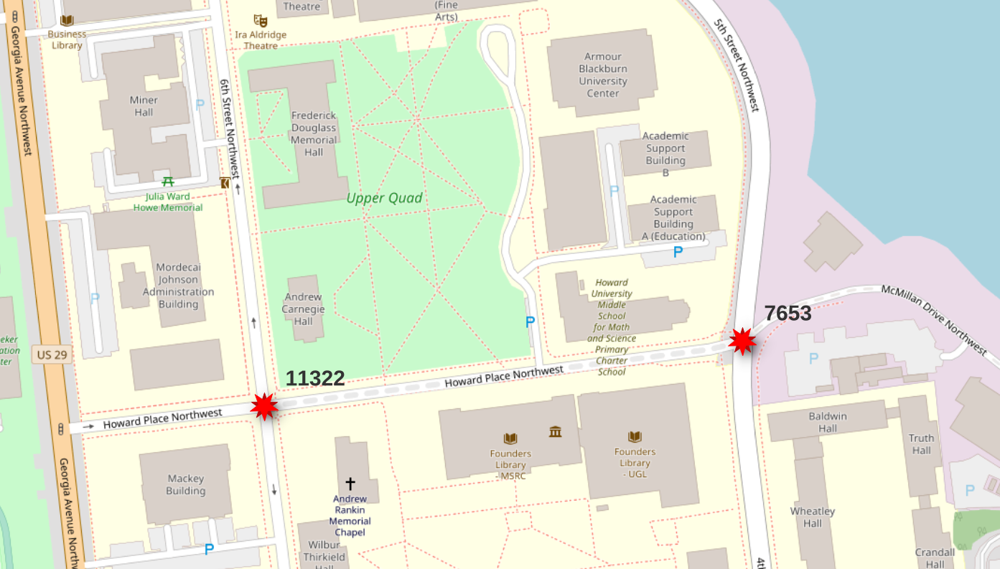

# Routing with PgOSM Flex


```sql
CREATE EXTENSION pgrouting;
```

Prepare roads for routing.

```sql
SELECT pgr_nodeNetwork('osm.road_line', .1, 'osm_id', 'geom');
SELECT pgr_createTopology('osm.road_line_noded', 0.1, 'geom');
SELECT pgr_analyzeGraph('osm.road_line_noded', 0.1, 'geom');
```

Add simple `cost_length` column.


```sql
ALTER TABLE osm.road_line_noded
    ADD cost_length DOUBLE PRECISION NOT NULL
    GENERATED ALWAYS AS (ST_Length(geom))
    STORED; 
```



## Simple route

Exaple route using all roads, no access checks.

```sql
SELECT d.*, n.the_geom AS node_geom, e.geom AS edge_geom
    FROM pgr_dijkstra(
        'SELECT id, source, target, cost_length AS cost,
                geom
            FROM osm.road_line_noded',
                     11322, 7653, directed := False
        ) d
    INNER JOIN osm.road_line_noded_vertices_pgr n ON d.node = n.id
    LEFT JOIN osm.road_line_noded e ON d.edge = e.id
;
```

## Route motorized

Add join to source road data to get access control.  Limits to roads
with `route_motor = True`. See `flex-config/helpers.lua`
functions (e.g. `routable_motor()`) for logic behind access
control columns.


```sql
SELECT d.*, n.the_geom AS node_geom, e.geom AS edge_geom
    FROM pgr_dijkstra(
        'SELECT n.id, n.source, n.target, n.cost_length AS cost,
                n.geom
            FROM osm.road_line_noded n
            INNER JOIN osm.road_line r
            	ON n.old_id = r.osm_id
            		AND route_motor',
                     11322, 7653, directed := False
        ) d
    INNER JOIN osm.road_line_noded_vertices_pgr n ON d.node = n.id
    LEFT JOIN osm.road_line_noded e ON d.edge = e.id
;
```

